# SecureMail AI

## AI-Powered Email Spam & Phishing Detection System

---

## Project Overview

**SecureMail AI** is an AI-powered cybersecurity web application that detects and classifies emails as:

* Legitimate
* Spam
* Phishing

The system uses Machine Learning and Natural Language Processing techniques to analyze email content, calculate risk levels, and provide security recommendations.

The main objective of this project is to help users identify malicious emails and improve awareness against phishing attacks and email-based cyber threats.

---

# Features

## User Authentication

* User registration and login
* Secure session management
* User profile management

## AI Email Scanner

* Analyze email subject and body content
* Detect suspicious email patterns
* Classify emails into:

  * Legitimate
  * Spam
  * Phishing

## Machine Learning Detection

* Text preprocessing
* Feature extraction
* ML-based email classification
* Prediction confidence calculation

## Risk Assessment

* Generates risk score (0-100%)
* Identifies threat level:

  * Low Risk
  * Medium Risk
  * High Risk

## Security Dashboard

* Total email scans
* Legitimate email statistics
* Spam and phishing statistics
* Recent scan activity

## Scan History

* Stores previous scan results
* Search and filter scanned emails
* View detailed reports
* Delete scan records

## Security Reports

* Generates downloadable PDF reports
* Includes:

  * Email classification
  * Confidence score
  * Risk score
  * Threat analysis
  * Security recommendations

## Admin Dashboard

* Monitor application activity
* View system statistics
* Manage scan records

---

# System Architecture

```
                 User
                  |
                  |
          Email Input
                  |
                  v
        Frontend Interface
   HTML | CSS | Bootstrap | JS
                  |
                  v
          Flask Backend
              Python
                  |
        -----------------
        |               |
        v               v
   ML Model        Database
 Scikit-learn      SQLite
        |
        v
 Email Classification
        |
        v
 Risk Score + Security Recommendation
```

---

# Machine Learning Workflow

```
Email Content
      |
      v
Text Preprocessing
      |
      v
Feature Extraction
(TF-IDF Vectorization)
      |
      v
Machine Learning Model
      |
      v
Prediction
      |
      v
Risk Score Generation
```

---

# Technology Stack

## Frontend

* HTML5
* CSS3
* JavaScript
* Bootstrap 5

## Backend

* Python
* Flask

## Machine Learning

* Scikit-learn
* Pandas
* NumPy

## Database

* SQLite

## Visualization

* Chart.js

## Report Generation

* ReportLab

---

# Project Structure

```
SECUREMAILAI
│
├── app/
│
├── instance/
│
├── screenshots/
│
├── tests/
│
├── .gitignore
├── README.md
├── requirements.txt
└── run.py
```

---

# Installation & Setup

### 1. Clone Repository

```bash
git clone <repository-url>
```

### 2. Navigate to Project Folder

```bash
cd SECUREMAILAI
```

### 3. Create Virtual Environment

```bash
python -m venv venv
```

### 4. Activate Virtual Environment

Windows:

```bash
venv\Scripts\activate
```

### 5. Install Dependencies

```bash
pip install -r requirements.txt
```

### 6. Run Application

```bash
python run.py
```

Application runs at:

```
http://127.0.0.1:5000
```

---

# Application Screenshots

## Landing Page

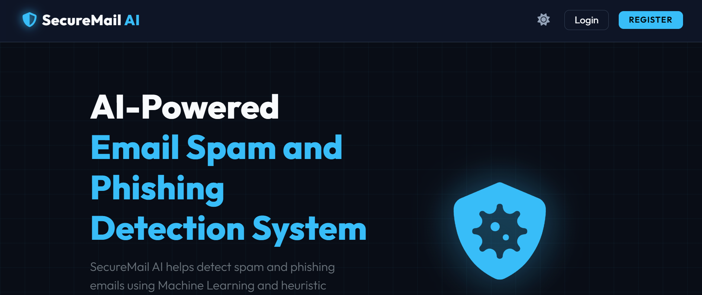
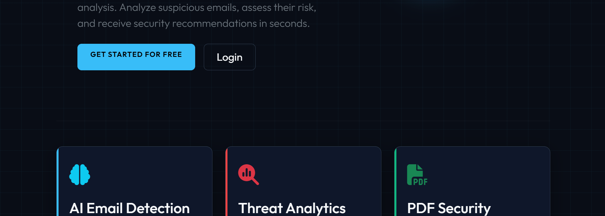
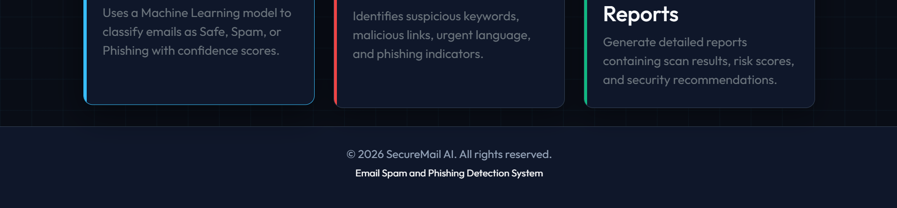

---

## User Dashboard

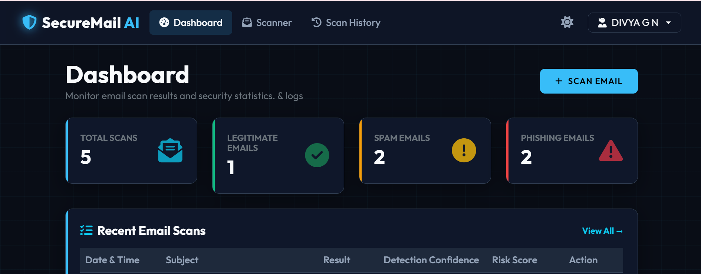
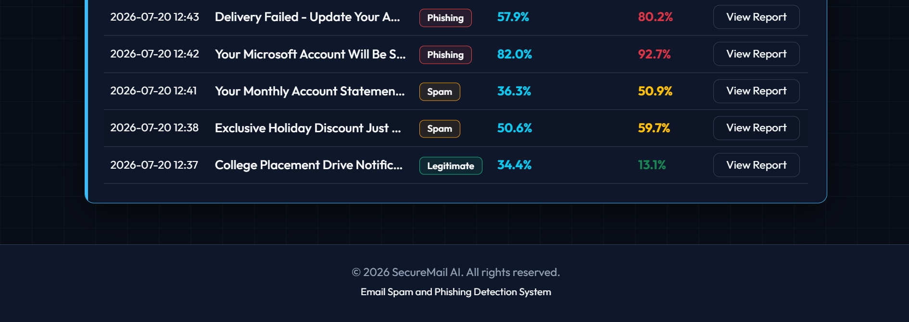

---

## Email Scanner

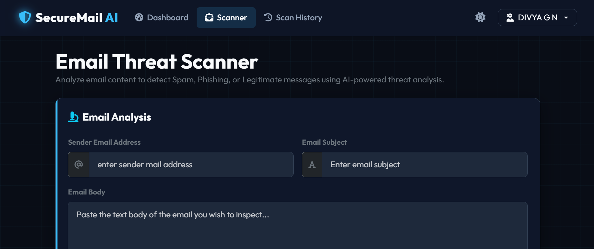
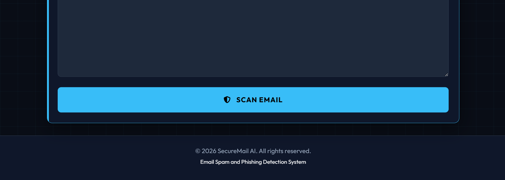

---

## Scan Result

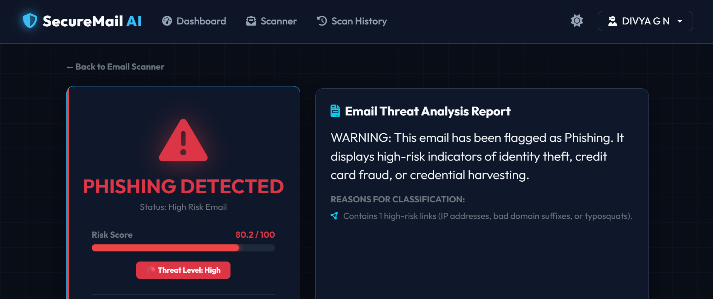
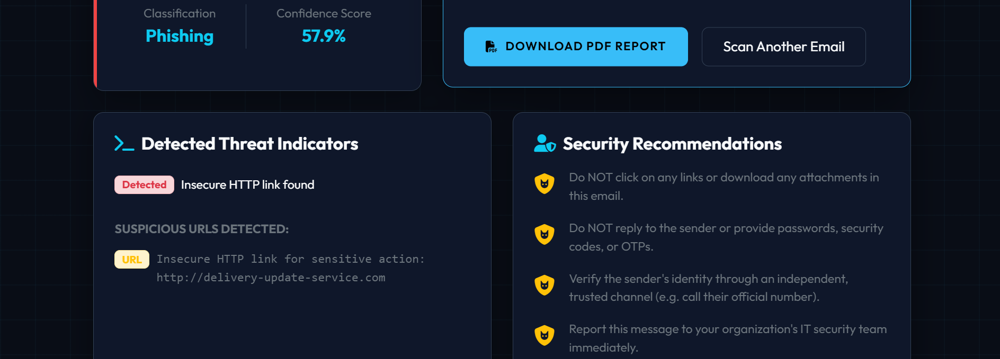
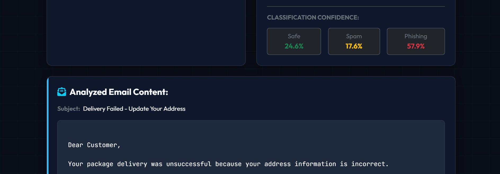
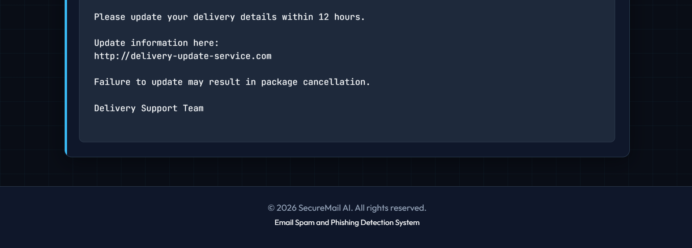

---

## Scan History

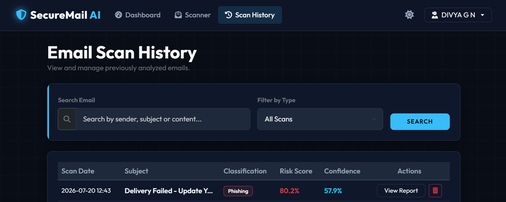
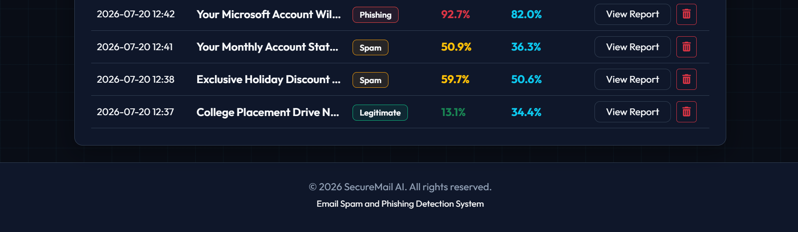

## Admin Dashboard

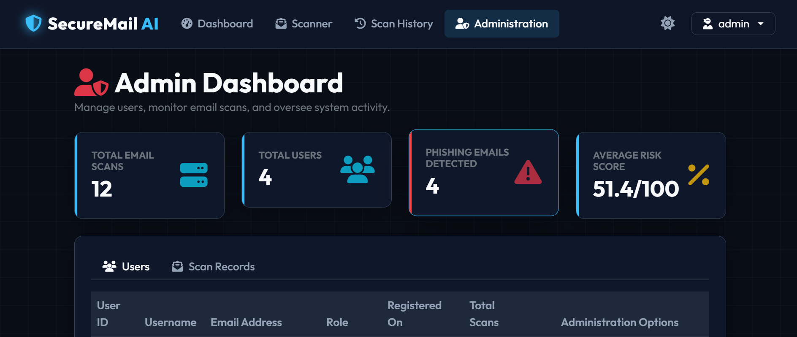
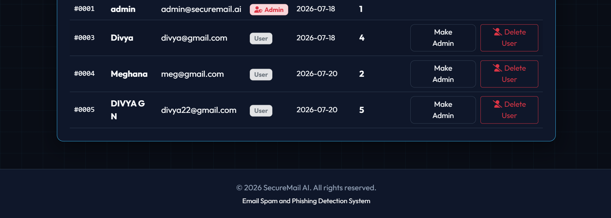

> >  **Note:** Additional detailed application screenshots and a sample PDF report are available in the `screenshot` folder for complete UI reference.
---


# Future Enhancements

* Gmail and Outlook integration
* Real-time email monitoring
* Attachment malware scanning
* Browser extension support

---

# Developer

**Divya G N**

Final Year BE Computer Science Student

---

